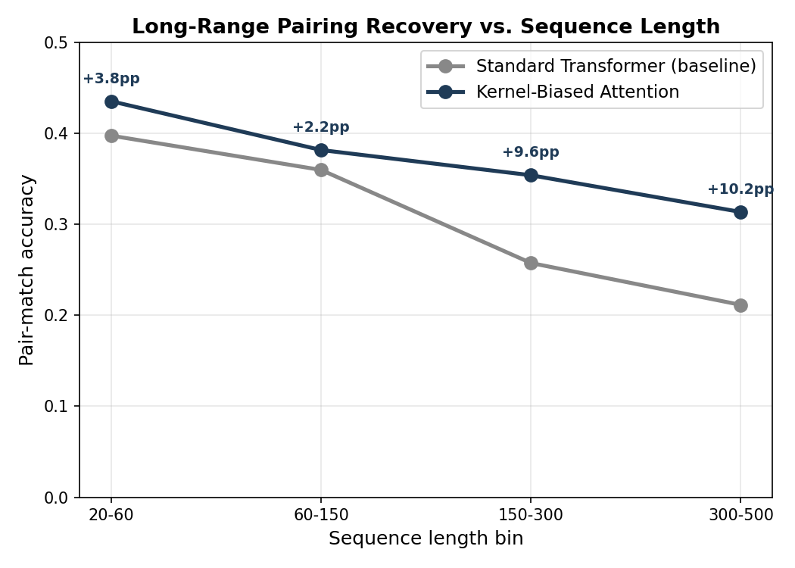

# Long-Range Structural Dependencies in Transformers (synthetic RNA-like pairing)

**Motivation.** RNA secondary structure is built from *nested, non-crossing
base pairs* that are often far apart in the sequence. Standard Transformer
self-attention has no inductive bias toward this kind of structured,
distance-growing dependency, and is known to degrade on long-range tasks
(this is the whole premise of benchmarks like Long Range Arena). This
project builds a small, controlled testbed to (1) measure exactly how a
standard Transformer's ability to recover long-range pairings degrades as
sequence length grows, and (2) test whether an attention mechanism inspired
by integral/kernel operators (connecting to numerical methods for Fredholm
integral equations) improves long-range recovery.

## What's here

- `data_gen.py` — generates synthetic sequences (alphabet A/U/G/C) whose
  secondary structure is sampled from a stochastic context-free grammar
  that produces nested, non-crossing pairs with a minimum loop size (mirrors
  the real biophysical constraint). Bases at paired positions are filled in
  according to real RNA pairing rules (A-U, G-C, G-U wobble). Output is
  dot-bracket notation (`.` unpaired, `(` open, `)` close), the standard
  representation used in RNA bioinformatics.
- `model.py` — a standard Transformer encoder (PyTorch built-ins, sinusoidal
  positional encoding, vanilla multi-head self-attention) doing per-position
  3-way classification (unpaired / open / close).
- `model_kernel.py` — `KernelAttentionTransformer`: identical embedding /
  positional encoding / classifier head to the baseline, but self-attention
  logits get an additive bias k(i, j), learned as a nonlinear function of
  the relative distance (i - j) via a small MLP, one such kernel per
  attention head per layer.
- `pair_aux.py` — a pointer-network-style auxiliary loss (`PairHead`) that
  directly supervises which position is the true pairing partner of each
  open/close position, on top of the per-position classification loss.
- `train_utils.py` — shared training/evaluation code (data loading, class
  weighting, training loop, length-bin evaluation) used by both models for
  a fair, controlled comparison.
- `compare.py` — trains both models under identical conditions (same data,
  optimizer, epochs, model size) and compares pair-match accuracy across
  four held-out sequence-length bins (20-60, 60-150, 150-300, 300-500).

**Metrics used:**
- **token accuracy**: raw per-position classification accuracy (dominated
  by the easy "unpaired" class, so not very informative alone)
- **pair-match accuracy**: for every true base pair (i, j), checks whether
  the model correctly predicts *both* i as open and j as close — this is
  the metric that actually reflects whether long-range structure was
  recovered.

## Why this attention variant, specifically

Standard numerical solvers for Fredholm integral equations
f(x) = g(x) + λ∫k(x,y)f(y)dy discretize the kernel function k(x,y) on a
quadrature grid and solve the resulting linear system (the Nystrom method)
— and Nystromformer (Xiong et al., 2021) borrows this exact numerical idea
to approximate softmax attention efficiently. This project runs that
connection the other way: rather than approximating attention, it gives
the model an explicit, directly-trainable k(i,j) kernel term as a
*dedicated* pathway for long-range structural bias, separate from
content-based QK similarity — motivated by the fact that RNA-like pairing
is not "closer = more likely" (which a fixed monotonic decay like ALiBi
assumes) but structured and genuinely long-range.

## How to run

```bash
pip install torch matplotlib
python data_gen.py     # writes data/train.jsonl, val.jsonl, and 4 test bins
python compare.py      # trains both models, writes comparison_results.json
                        # and prints a pair-match-accuracy table by length bin
```

Training is CPU-feasible for small smoke tests but slow at full scale (20k
examples, 30 epochs) — a free Colab GPU runtime is enough (each model is a
few million parameters).

## Result

Full-scale run (20k training examples, 30 epochs, class-weighted loss +
pair-aware auxiliary loss — see "Training notes" below): the kernel-biased
attention model outperforms the standard Transformer baseline on
pair-match accuracy across every length bin, and **the gap widens with
sequence length** rather than shrinking:

| Length bin | Baseline | Kernel-biased | Δ |
|---|---|---|---|
| 20-60 | 39.8% | 43.5% | +3.8pp |
| 60-150 | 36.0% | 38.2% | +2.2pp |
| 150-300 | 25.8% | 35.4% | **+9.6pp** |
| 300-500 | 21.2% | 31.4% | **+10.2pp** |



The baseline degrades sharply as sequences get longer (39.8% → 21.2%),
consistent with the known weakness of standard self-attention on nested,
long-range structural dependencies. The kernel-biased model degrades much
more gently (43.5% → 31.4%), supporting the hypothesis that an explicit,
learned distance kernel gives the model a more direct pathway for
long-range structural bias than content-based attention alone has to learn
implicitly.

This was a single training run (one seed each) — worth re-running with a
couple of different seeds before treating the exact numbers as a firm
result, though the consistent widening trend across all four bins is a
reasonably strong signal on its own.

## Training notes (debugging history)

Getting a meaningful result required two corrections beyond the initial
baseline setup, both surfaced by diagnosing why pair-match accuracy was
stuck at exactly 0% for both models under plain, unweighted cross-entropy:

1. **Class-weighted loss.** The task is class-imbalanced (~65% unpaired,
   ~17.5% open, ~17.5% close); plain cross-entropy let both models settle
   into "always predict unpaired" as a safe local minimum matching the
   majority-class base rate exactly. Weighting the loss by inverse class
   frequency was necessary to get any real learning signal for the
   minority (structurally important) classes.
2. **Pair-aware auxiliary loss** (`pair_aux.py`). Token-level classification
   alone only supervises "what label is at position i", never "position
   i's partner is position j". A pointer-network-style `PairHead` adds a
   direct supervised signal for the actual matching structure, combined
   with the token loss as `L = L_token(weighted) + 0.3 * L_pair`.

Both fixes were validated on medium-scale runs before being applied at
full scale, to isolate whether an intervention actually helped before
spending a full GPU training run on it.

## Next steps

1. **Interpretability pass**: probe attention heads / hidden states of the
   trained models to see whether any heads (or the learned kernels
   themselves) specialize in tracking "current nesting depth" or "distance
   to matching partner". The learned k(i,j) kernels are directly
   visualizable (unlike standard attention weights), which makes this a
   natural next experiment now that both models are actually learning the
   task.
2. Write up results as a short technical report, including visualizations
   of a few learned distance kernels per head/layer.
3. If results hold up across seeds, consider testing on real RNA secondary
   structure data (e.g. from the RNA STRAND or bpRNA databases) instead of
   only the synthetic SCFG-generated sequences.
